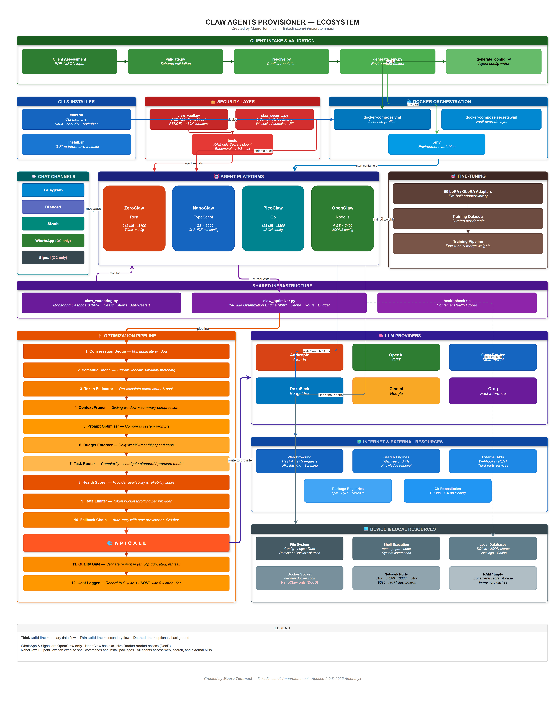

# Claw Agents Provisioner

One-command deployment of personalized AI agents. Transform a client needs assessment into a fully configured, running AI agent with domain-specific fine-tuning.

```bash
./claw.sh deploy --assessment client-assessment.json
```

## What It Does

1. A consultant fills out a client assessment form (JSON)
2. The system auto-selects the right platform, LLM model, and skills
3. It generates all configuration files and optionally triggers fine-tuning
4. The client gets a running, personalized AI agent in under 15 minutes

## Supported Platforms

| Platform | Language | Best For | Resource Usage |
|----------|----------|----------|---------------|
| **ZeroClaw** | Rust | Efficiency, encryption, multi-provider | 7.8 MB binary |
| **NanoClaw** | TypeScript | Security-critical, container isolation | Claude-native |
| **PicoClaw** | Go | Edge/IoT, Raspberry Pi, budget | 8 MB RAM |
| **OpenClaw** | TypeScript | Maximum integrations, 50+ channels | Full-featured |
| **Parlant** | Python | Guideline-driven conversational AI, MCP tools | 2 GB limit |

## Quick Start

### Prerequisites

- Docker + Docker Compose (or Vagrant + VirtualBox)
- Python 3.11+ (for assessment pipeline; Python 3.10+ for Parlant)
- Git

### Interactive Installer (Recommended)

The easiest way to set up the entire project is the interactive installer:

```bash
git clone https://github.com/Amenthyx/claw-agents-provisioner.git
cd claw-agents-provisioner
chmod +x install.sh
./install.sh
```

This opens an interactive menu that walks you through every step:

```
  ███████╗██╗   ██╗███████╗██████╗ ██╗   ██╗ ██████╗██╗      █████╗ ██╗    ██╗
  ██╔════╝██║   ██║██╔════╝██╔══██╗╚██╗ ██╔╝██╔════╝██║     ██╔══██╗██║    ██║
  █████╗  ██║   ██║█████╗  ██████╔╝ ╚████╔╝ ██║     ██║     ███████║██║ █╗ ██║
  ██╔══╝  ╚██╗ ██╔╝██╔══╝  ██╔══██╗  ╚██╔╝  ██║     ██║     ██╔══██║██║███╗██║
  ███████╗ ╚████╔╝ ███████╗██║  ██║   ██║   ╚██████╗███████╗██║  ██║╚███╔███╔╝
  ╚══════╝  ╚═══╝  ╚══════╝╚═╝  ╚═╝   ╚═╝    ╚═════╝╚══════╝╚═╝  ╚═╝ ╚══╝╚══╝

  Main Menu

  0) System requirements check
  1) Base system provisioning     (Docker, Python, Git)
  2) Install Python dependencies  (reportlab, torch, etc.)
  3) Configure environment        (API keys, channels, agent)
  4) Assessment pipeline          (PDF forms, validation)
  5) Deploy agent                 (Docker, Vagrant, bare-metal)
  6) Fine-tuning                  (LoRA/QLoRA, datasets)
  7) Watchdog monitoring          (alerts, auto-restart, dashboard)
  8) Health check                 (verify running agents)
  9) Multi-instance setup         (named instances, separate ports)
  10) Vault management            (encrypted secrets)
  11) Optimization engine         (cost reports, routing proxy)
  12) Security rules              (content policies, compliance)
  13) Model strategy engine       (scan models, generate routing)

  f) Full setup (steps 1-7 sequentially)
  q) Quit
```

For non-interactive setup (CI/CD or scripted deployments):

```bash
./install.sh --full    # Runs all steps sequentially with prompts
```

#### What Each Step Does

| Step | Description |
|------|-------------|
| **0 — Requirements check** | Verifies Git, Python 3.8+, Docker, Docker Compose, Vagrant (optional) |
| **1 — Base provisioning** | Installs Docker, Python 3.11+, pip, system utilities via `provision-base.sh` (Ubuntu/Debian) |
| **2 — Python dependencies** | Installs `reportlab pypdf jsonschema` for assessments, optionally `torch transformers peft` for fine-tuning |
| **3 — Environment config** | Interactive wizard: choose LLM provider + model, enter API keys, configure channels, select agent platform. Writes `.env` |
| **4 — Assessment pipeline** | Generate blank/pre-filled PDF forms (Private or Enterprise tier), validate JSON, convert filled PDFs back to JSON |
| **5 — Deploy agent** | Deploy via Docker, Vagrant, or bare-metal install scripts. Supports assessment-driven auto-deployment |
| **6 — Fine-tuning** | List/validate/download all 50 datasets, train LoRA or QLoRA adapters, dry-run mode |
| **7 — Watchdog monitoring** | Generate config, set up Telegram alerts, run health checks, install as systemd service, view dashboard |
| **8 — Health check** | Per-agent health verification, Docker container status, log tailing |
| **9 — Multi-instance** | Deploy named instances (e.g., lucia, priya) with separate ports, env files, and data volumes |
| **10 — Vault management** | Create/import/rotate/export encrypted secrets vault. Requires `pip install cryptography` |
| **11 — Optimization engine** | Generate config, view cost reports, start optimization proxy with 14 rules |
| **12 — Security rules** | Forbidden URLs, content rules, data handling, network policies, compliance modules |
| **13 — Model strategy engine** | Scan all local + cloud models, generate optimal per-task routing, view report, benchmark |

### Manual Setup

If you prefer to configure everything manually:

#### 1. Clone and configure

```bash
git clone https://github.com/Amenthyx/claw-agents-provisioner.git
cd claw-agents-provisioner
cp .env.template .env
# Edit .env with your API keys
```

#### 2. Deploy a specific agent

```bash
# Via Docker
./claw.sh zeroclaw docker
./claw.sh nanoclaw docker
./claw.sh picoclaw docker
./claw.sh openclaw docker
./claw.sh parlant docker

# Via Vagrant
./claw.sh zeroclaw vagrant
./claw.sh nanoclaw vagrant
./claw.sh parlant vagrant
```

#### 3. Deploy from assessment

```bash
# Validate the assessment first
./claw.sh validate --assessment client-assessment.json

# Deploy (auto-selects platform, model, skills)
./claw.sh deploy --assessment client-assessment.json
```

## Assessment Pipeline

The assessment pipeline transforms a client intake form into a complete agent configuration:

```
client-assessment.json
    --> validate.py   (schema + business logic validation)
    --> resolve.py    (platform + model + skills selection)
    --> generate_env  (.env file with all settings)
    --> generate_config (agent-specific config files)
    --> claw.sh deploy (Docker or Vagrant provisioning)
```

### Resolution Algorithm

The resolver scores 16 deployment profiles using weighted factors:

| Factor | Weight | Description |
|--------|--------|-------------|
| Use case overlap | Highest | Match assessment use cases to profile |
| Budget fit | High | Must be affordable for client |
| Complexity match | Medium | Task difficulty alignment |
| Sensitivity match | Medium | Security requirements |
| Channel match | Medium | Communication channel support |
| Device affinity | Medium | Hardware constraints |
| Regulation match | Medium | Compliance alignment |
| Storage preference | Low | Data residency |

### Model Selection

| Condition | Model |
|-----------|-------|
| $0 budget | DeepSeek V3.2 (free tier) |
| Expert complexity + $100+ budget | Claude Opus 4.6 |
| Maximum context + $50+ budget | GPT-4.1 (1M tokens) |
| Default best value | Claude Sonnet 4.6 |

### PDF Assessment Form

Generate fillable PDF forms for clients. Two tiers available:

- **Private** — Simple, warm, non-technical. For small businesses and individual clients. Technical fields are auto-filled with safe defaults.
- **Enterprise** — Complete and technical, split into Part A (client fills) and Part B (Amenthyx fills after consultation).

```bash
# Generate blank Private form (default)
python assessment/generate_pdf_form.py --tier private

# Generate blank Enterprise form
python assessment/generate_pdf_form.py --tier enterprise

# Generate pre-filled from existing JSON
python assessment/generate_pdf_form.py --tier private --prefill assessment/client-assessment.example.json
python assessment/generate_pdf_form.py --tier enterprise --prefill assessment/client-assessment.example.json

# Convert filled PDF back to JSON (auto-detects tier)
python assessment/pdf_to_json.py filled-form.pdf -o client-assessment.json

# Convert with validation
python assessment/pdf_to_json.py filled-form.pdf -o client-assessment.json --validate
```

The converter auto-detects the tier from the PDF fields. Private forms get safe defaults applied (tech_savvy=3, pii_handling="encrypt", fine-tuning disabled, etc.) so the output JSON validates against the full schema.

Requirements: `pip install reportlab pypdf`

## Example Walkthroughs

### Real Estate Agent (Lucia)

Lucia runs a real estate agency in Milan. She needs a WhatsApp bot for lead qualification with Italian + English support.

```bash
# Assessment highlights:
# - Industry: real-estate
# - Budget: $25/month
# - Channels: WhatsApp
# - Languages: Italian, English
# - GDPR compliance required

./claw.sh deploy --assessment examples/example-realstate.json
# --> Selects: OpenClaw + Claude Sonnet 4.6
# --> Skills: whatsapp-business, crm-sync, auto-reply, lead-qualifier
# --> Fine-tuning: QLoRA with 02-real-estate dataset
```

### IoT Sensor Monitor (Priya)

Priya deploys sensor monitors on a Raspberry Pi fleet with $0 API budget.

```bash
# Assessment highlights:
# - Industry: iot
# - Budget: $0/month
# - Channels: Telegram
# - Devices: Raspberry Pi

./claw.sh deploy --assessment examples/example-iot.json
# --> Selects: PicoClaw + DeepSeek V3.2 (free)
# --> Skills: sensor-monitor, telegram-alerts
# --> Runs on 8 MB RAM
```

### DevSecOps Agent (Kai)

Kai's SaaS startup needs container-isolated code review with GDPR compliance.

```bash
# Assessment highlights:
# - Industry: software-development
# - Budget: $100+/month
# - Channels: Slack, GitHub
# - High data sensitivity
# - GDPR compliance required

./claw.sh deploy --assessment examples/example-devsecops.json
# --> Selects: NanoClaw + Claude Sonnet 4.6
# --> Skills: code-review, ci-integration, security-scan
# --> Container isolation enabled
```

## Fine-Tuning

### 50 Pre-Built Datasets

All datasets are committed in-repo (250,000 total rows from HuggingFace):

```bash
# List all datasets
./claw.sh datasets --list

# Validate all 50 datasets
./claw.sh datasets --validate

# Train a LoRA adapter
./claw.sh finetune --adapter customer-support

# Train with QLoRA (less VRAM)
python finetune/train_qlora.py --adapter 01-customer-support

# Dry run (validate without training)
./claw.sh finetune --adapter customer-support --dry-run
```

### Dataset Examples (All 50)

Below is one representative sample from each dataset showing the system prompt, user query, and assistant response.

<details>
<summary><strong>01 — Customer Support & Helpdesk</strong></summary>

```json
{
  "messages": [
    {"role": "system", "content": "You are a professional customer support agent. You handle inquiries with patience, clarity, and efficiency..."},
    {"role": "user", "content": "I'd like to add a product to purchase {{Order Number}} will you help me"},
    {"role": "assistant", "content": "Thank you for reaching out to us with your request. I understand that you would like to add a product to your purchase with the purchase number {{Order Number}}. I'll be glad to assist you with this."}
  ]
}
```
</details>

<details>
<summary><strong>02 — Real Estate Agent</strong></summary>

```json
{
  "messages": [
    {"role": "system", "content": "You are Sara, a knowledgeable real estate assistant. You help buyers and tenants find properties, understand market trends, and navigate the buying/renting process..."},
    {"role": "user", "content": "Who designed the current Indian flag?"},
    {"role": "assistant", "content": "The current Indian flag was designed by Pingali Venkayya. It is based on the Swaraj flag, a flag of the Indian National Congress party."}
  ]
}
```
</details>

<details>
<summary><strong>03 — E-Commerce Assistant</strong></summary>

```json
{
  "messages": [
    {"role": "system", "content": "You are a helpful e-commerce shopping assistant. You help customers find products, compare options, track orders, and handle returns."},
    {"role": "user", "content": "Find the longest word in the paragraph and explain the meaning of that word. Context: In computing, artificial intelligence (AI) is the simulation of..."},
    {"role": "assistant", "content": "The longest word in the paragraph is \"approximate\", which contains 11 letters. The word approximate means close to the actual but not completely accurate, or an estimate."}
  ]
}
```
</details>

<details>
<summary><strong>04 — Healthcare Triage</strong></summary>

```json
{
  "messages": [
    {"role": "system", "content": "You are a healthcare triage assistant. You provide general health information and guide patients to appropriate care. Always remind patients to consult a doctor..."},
    {"role": "user", "content": "What is (are) Primary Biliary Cirrhosis?"},
    {"role": "assistant", "content": "Primary biliary cirrhosis is a chronic, or long lasting, disease that causes the small bile ducts in the liver to become inflamed and damaged and ultimately disappear."}
  ]
}
```
</details>

<details>
<summary><strong>05 — Legal Document Review</strong></summary>

```json
{
  "messages": [
    {"role": "system", "content": "You are a legal document review assistant. You analyze contracts, identify risks, and explain legal terminology. Disclaimer: This is informational only..."},
    {"role": "user", "content": "Build an AI system to provide customer support."},
    {"role": "assistant", "content": "To build an effective AI system for providing customer support, several key steps and considerations must be made. Here's an outline of the process: 1. Define the scope of the AI system..."}
  ]
}
```
</details>

<details>
<summary><strong>06 — Personal Finance Advisor</strong></summary>

```json
{
  "messages": [
    {"role": "system", "content": "You are a personal finance advisor helping with budgets, investments, and financial planning. Recommend consulting a certified financial advisor for major decisions..."},
    {"role": "user", "content": "Where can you find kangaroos?"},
    {"role": "assistant", "content": "Kangaroos are primarily found in Australia and some surrounding islands."}
  ]
}
```
</details>

<details>
<summary><strong>07 — Code Review & Dev Workflow</strong></summary>

```json
{
  "messages": [
    {"role": "system", "content": "You are a senior software engineer conducting code reviews. Identify bugs, suggest improvements, and enforce best practices constructively."},
    {"role": "user", "content": "Generate a Python program that calculates the total number of vowels in a sentence. Context: This sentence has five vowels"},
    {"role": "assistant", "content": "def count_vowels(sentence):\n  vowels = ['a', 'e', 'i', 'o', 'u']\n  count = 0\n  for word in sentence.split():\n    for letter in word:\n      if letter in vowels:\n        count += 1\n  return count"}
  ]
}
```
</details>

<details>
<summary><strong>08 — Email Management & Drafting</strong></summary>

```json
{
  "messages": [
    {"role": "system", "content": "You are an email management assistant helping draft professional emails, summarize inboxes, and manage email workflows."},
    {"role": "user", "content": "Draft a subject line for this email: Charger Parents- Our end of season party will be after our last game on Sat. Nov. 17th (9:00am game) at Firetruck..."},
    {"role": "assistant", "content": "Suggested subject: Chargers Soccer Team Party and Trophy $$"}
  ]
}
```
</details>

<details>
<summary><strong>09 — Calendar & Scheduling</strong></summary>

```json
{
  "messages": [
    {"role": "system", "content": "You are a calendar and scheduling assistant managing appointments, finding time slots, resolving conflicts, and optimizing daily schedules."},
    {"role": "user", "content": "Make a children's story about a treasure hunt."},
    {"role": "assistant", "content": "Once upon a time, in a magical land lived a group of five friends named Jack, Lily, Sam, Mia, and Max. They were always up for a fun adventure, and one sunny day, they decided to go on a treasure hunt..."}
  ]
}
```
</details>

<details>
<summary><strong>10 — Meeting Summarization</strong></summary>

```json
{
  "messages": [
    {"role": "system", "content": "You are a meeting summarization assistant. You create concise summaries, extract action items, and track decisions."},
    {"role": "user", "content": "Summarize this conversation: #Person1#: Pasadena Traffic School. How can I help you? #Person2#: I would like to sign up for some classes..."},
    {"role": "assistant", "content": "Summary: #Person2# wants to sign up for a driver's course. #Person1# helps #Person2# make an appointment to sign the papers."}
  ]
}
```
</details>

<details>
<summary><strong>11 — Sales & CRM Assistant</strong></summary>

```json
{
  "messages": [
    {"role": "system", "content": "You are a sales CRM assistant managing leads, tracking deals, and optimizing the sales pipeline."},
    {"role": "user", "content": "List 5 characteristics of an ideal travel destination"},
    {"role": "assistant", "content": "Here are five characteristics of an ideal travel destination: 1. Scenic Beauty: An ideal travel destination should boast stunning natural landscapes, picturesque views, and breathtaking sights..."}
  ]
}
```
</details>

<details>
<summary><strong>12 — HR & Recruitment</strong></summary>

```json
{
  "messages": [
    {"role": "system", "content": "You are an HR recruitment assistant helping with job descriptions, resume screening, interviews, and hiring pipeline management."},
    {"role": "user", "content": "Write a story using the words 'galaxy' and 'journey'."},
    {"role": "assistant", "content": "Once upon a time, in a galaxy far, far away, there was a team of explorers who set out on an epic journey across the cosmos. They traveled on their trusty spaceship, traversing nebulae and black holes..."}
  ]
}
```
</details>

<details>
<summary><strong>13 — IT Helpdesk & Troubleshooting</strong></summary>

```json
{
  "messages": [
    {"role": "system", "content": "You are an IT helpdesk support agent troubleshooting technical issues and guiding users through solutions."},
    {"role": "user", "content": "Write a few sentences about a given historical figure. Amelia Earhart"},
    {"role": "assistant", "content": "Amelia Earhart was a pioneering aviator and the first woman to fly solo across the Atlantic Ocean. She broke numerous records and inspired a generation of female pilots. Her disappearance in 1937 during an attempt to fly around the world remains one of aviation's greatest mysteries."}
  ]
}
```
</details>

<details>
<summary><strong>14 — Content Writing & Marketing</strong></summary>

```json
{
  "messages": [
    {"role": "system", "content": "You are a content writing assistant specializing in blog posts, ad copy, SEO content, and social media copy."},
    {"role": "user", "content": "[WP] The outgoing President of the United States has written a letter to the newly inaugurated..."},
    {"role": "assistant", "content": "To my young, idealistic friend, I'm sure you've wondered why every president promises so much, and delivers so little. I'm sure you think you're the one to break that spell..."}
  ]
}
```
</details>

<details>
<summary><strong>15 — Social Media Management</strong></summary>

```json
{
  "messages": [
    {"role": "system", "content": "You are a social media management assistant creating posts, planning calendars, analyzing engagement, and managing brand presence."},
    {"role": "user", "content": "Analyze this social media post: \"See my article in @user and then see Amy Schumer at the BB&T Center this Saturday\""},
    {"role": "assistant", "content": "Sentiment: neutral. This post conveys a neutral tone. For engagement, consider responding with helpful information."}
  ]
}
```
</details>

<details>
<summary><strong>16 — Translation & Multilingual</strong></summary>

```json
{
  "messages": [
    {"role": "system", "content": "You are a multilingual translation assistant preserving tone, cultural nuances, and context across languages."},
    {"role": "user", "content": "Translate to French: \"My God! What can have become of her, then?\""},
    {"role": "assistant", "content": "-- Ah! mon Dieu! mais qu'est-elle devenue alors?"}
  ]
}
```
</details>

<details>
<summary><strong>17 — Education & Tutoring</strong></summary>

```json
{
  "messages": [
    {"role": "system", "content": "You are an educational tutor explaining concepts clearly, adapting to the student's level, and encouraging learning."},
    {"role": "user", "content": "What are the building blocks of DNA?"},
    {"role": "assistant", "content": "Nucleotides. The building blocks of DNA are nucleotides. The important components of the nucleotide are a nitrogenous base, deoxyribose (5-carbon sugar), and a phosphate group."}
  ]
}
```
</details>

<details>
<summary><strong>18 — Research & Summarization</strong></summary>

```json
{
  "messages": [
    {"role": "system", "content": "You are a research assistant summarizing academic papers, extracting key findings, and assisting with literature reviews."},
    {"role": "user", "content": "Summarize this research paper: Fullerenes are carbon-cage molecules comprised of carbon atoms that are arranged on a sphere..."},
    {"role": "assistant", "content": "Summary: A fullerene graph is a cubic bridgeless planar graph with twelve 5-faces such that all other faces are 6-faces. We show that any fullerene graph on n vertices can be bipartized by removing..."}
  ]
}
```
</details>

<details>
<summary><strong>19 — Data Analysis & Reporting</strong></summary>

```json
{
  "messages": [
    {"role": "system", "content": "You are a data analysis assistant helping with SQL queries, data interpretation, reporting, and statistical insights."},
    {"role": "user", "content": "What is the year when Scuderia Lancia Corse competed? Table schema: CREATE TABLE table_name_51 (year VARCHAR, team VARCHAR)"},
    {"role": "assistant", "content": "SQL Query: SELECT COUNT(year) FROM table_name_51 WHERE team = \"scuderia lancia corse\""}
  ]
}
```
</details>

<details>
<summary><strong>20 — Project Management</strong></summary>

```json
{
  "messages": [
    {"role": "system", "content": "You are a project management assistant helping plan sprints, track tasks, manage risks, and run agile ceremonies."},
    {"role": "user", "content": "Create a list of best practices that should be followed in this field. Healthcare information technology"},
    {"role": "assistant", "content": "1. Prioritize and maintain patient privacy and security: Ensure that all patient data is kept confidential and secure by adhering to HIPAA and other healthcare regulations. 2. Utilize evidence-based..."}
  ]
}
```
</details>

<details>
<summary><strong>21 — Accounting & Bookkeeping</strong></summary>

```json
{
  "messages": [
    {"role": "system", "content": "You are an accounting assistant helping with financial records, tax preparation, expense tracking, and reporting."},
    {"role": "user", "content": "Why don't SPY, SPX, and the e-mini S&P 500 track perfectly with each other?"},
    {"role": "assistant", "content": "The S&P 500 is an index. This refers to a specific collection of securities which is held in perfect proportion. The dollar value of an index is scaled arbitrarily and is based off of an arbitrary starting point."}
  ]
}
```
</details>

<details>
<summary><strong>22 — Insurance Claims Processing</strong></summary>

```json
{
  "messages": [
    {"role": "system", "content": "You are an insurance claims assistant helping file claims, explain coverage, and track claim status."},
    {"role": "user", "content": "Compare the features of hot and cold data storage."},
    {"role": "assistant", "content": "Hot and cold data storage are two tiers of storage systems used to optimize data processing based on how frequently that data is used. Hot Data Storage: This type of storage, also called tier-1 or primary storage..."}
  ]
}
```
</details>

<details>
<summary><strong>23 — Travel & Hospitality</strong></summary>

```json
{
  "messages": [
    {"role": "system", "content": "You are a travel assistant helping plan trips, find accommodations, and suggest itineraries."},
    {"role": "user", "content": "Create a story ending the sentence. The river wound its way through the forest,"},
    {"role": "assistant", "content": "The river wound its way through the forest, cascading over rocks and tumbling through rapids as it traveled towards its final destination. Along its banks, tall trees swayed gently in the breeze..."}
  ]
}
```
</details>

<details>
<summary><strong>24 — Food & Restaurant</strong></summary>

```json
{
  "messages": [
    {"role": "system", "content": "You are a food and restaurant assistant helping with menu recommendations, dietary needs, and reservations."},
    {"role": "user", "content": "Give an example of how the following tech features help in using a mobile phone. Voice recognition"},
    {"role": "assistant", "content": "Voice recognition technology allows users to interact with their mobile phone using voice commands. For example, instead of manually typing out a message, a user can dictate the message using their voice..."}
  ]
}
```
</details>

<details>
<summary><strong>25 — Fitness & Wellness</strong></summary>

```json
{
  "messages": [
    {"role": "system", "content": "You are a fitness coach assistant creating workout plans and providing nutrition advice. Recommend consulting a physician first."},
    {"role": "user", "content": "Using the provided text, rewrite the sentence incorporating a metaphor. His arms were as weak as a feather."},
    {"role": "assistant", "content": "His arms were nothing more than feather-like twigs, lacking the strength to perform even the simplest of tasks."}
  ]
}
```
</details>

<details>
<summary><strong>26 — Automotive & Vehicle</strong></summary>

```json
{
  "messages": [
    {"role": "system", "content": "You are an automotive assistant helping with maintenance, troubleshooting, and buying advice."},
    {"role": "user", "content": "Come up with a creative way to use artificial intelligence in the medical industry."},
    {"role": "assistant", "content": "One creative way the medical industry could utilize artificial intelligence is by developing a virtual assistant capable of performing a preliminary medical diagnosis. The AI assistant would be trained..."}
  ]
}
```
</details>

<details>
<summary><strong>27 — Supply Chain & Logistics</strong></summary>

```json
{
  "messages": [
    {"role": "system", "content": "You are a supply chain assistant helping with inventory management, shipping, and demand forecasting."},
    {"role": "user", "content": "Execute a SQL query to find the names of the customers who have not placed any order."},
    {"role": "assistant", "content": "As an AI language model, I don't have database access, but I can provide you a sample SQL query: SELECT c.name FROM customers c LEFT JOIN orders o ON c.id = o.customer_id WHERE o.id IS NULL"}
  ]
}
```
</details>

<details>
<summary><strong>28 — Manufacturing & QA</strong></summary>

```json
{
  "messages": [
    {"role": "system", "content": "You are a manufacturing QA assistant helping with defect tracking, process improvement, and quality standards."},
    {"role": "user", "content": "Please generate a paragraph on the topic of \"Data Science\"."},
    {"role": "assistant", "content": "Data science is an interdisciplinary field that involves the use of statistical and computational methods to extract valuable insights from large and complex data sets. It combines elements of mathematics, statistics, computer science..."}
  ]
}
```
</details>

<details>
<summary><strong>29 — Agriculture & Farming</strong></summary>

```json
{
  "messages": [
    {"role": "system", "content": "You are an agriculture assistant providing advice on crop management, pest control, soil health, and farm operations."},
    {"role": "user", "content": "Generate a recipe for an easy-to-make vegan salad."},
    {"role": "assistant", "content": "Here's an easy and delicious recipe for a vegan salad that serves 4 people: Ingredients: 6 cups of mixed greens (spinach, kale, arugula, and romaine), 1 can of chickpeas drained and rinsed..."}
  ]
}
```
</details>

<details>
<summary><strong>30 — Energy & Utilities</strong></summary>

```json
{
  "messages": [
    {"role": "system", "content": "You are an energy utilities assistant helping with efficiency, bill analysis, renewables, and smart grid management."},
    {"role": "user", "content": "Generate a movie review for the movie A Quiet Place."},
    {"role": "assistant", "content": "A Quiet Place is a suspenseful and thrilling film that masterfully builds tension and keeps viewers on the edge of their seats. The film, directed by John Krasinski, tells the story of a family living in silence..."}
  ]
}
```
</details>

<details>
<summary><strong>31 — Telecommunications</strong></summary>

```json
{
  "messages": [
    {"role": "system", "content": "You are a telecom support assistant helping with plans, billing, network issues, and service upgrades."},
    {"role": "user", "content": "Write a comparison between two products. Product A: 3.2GHz 8-Core Intel Xeon W processor, 32GB RAM. Product B: 4.5GHz 6-Core Intel..."},
    {"role": "assistant", "content": "Product A and Product B are both high-end computers, but they have some key differences that are worth noting. Product A comes with a 3.2GHz 8-core Intel Xeon W processor, while Product B has a slightly faster..."}
  ]
}
```
</details>

<details>
<summary><strong>32 — Government & Public Services</strong></summary>

```json
{
  "messages": [
    {"role": "system", "content": "You are a government services assistant helping citizens navigate public services, regulations, and programs."},
    {"role": "user", "content": "Describe the different characteristics of a well-written news article."},
    {"role": "assistant", "content": "A well-written news article is one that effectively informs and engages its readers. Some of its key characteristics include: 1. Clarity: A well-written news article is clear and concise, free from jargon..."}
  ]
}
```
</details>

<details>
<summary><strong>33 — Nonprofit & Fundraising</strong></summary>

```json
{
  "messages": [
    {"role": "system", "content": "You are a nonprofit fundraising assistant helping with donor engagement, campaigns, and grant writing."},
    {"role": "user", "content": "Describe what a carbon footprint is."},
    {"role": "assistant", "content": "A carbon footprint is the total amount of greenhouse gas emissions produced by an individual, group or organization, during a given period of time, usually calculated over the course of a year."}
  ]
}
```
</details>

<details>
<summary><strong>34 — Event Planning & Coordination</strong></summary>

```json
{
  "messages": [
    {"role": "system", "content": "You are an event planning assistant helping organize events, manage vendors, create timelines, and coordinate logistics."},
    {"role": "user", "content": "During the last member meeting, create a list of 5 ideas to improve the club."},
    {"role": "assistant", "content": "Here are five ideas to improve the club: 1. Increase engagement: Encourage more participation and engagement among members with activities and events. 2. Expand outreach..."}
  ]
}
```
</details>

<details>
<summary><strong>35 — Cybersecurity & Threat Intel</strong></summary>

```json
{
  "messages": [
    {"role": "system", "content": "You are a cybersecurity assistant helping analyze threats, respond to incidents, and maintain security posture."},
    {"role": "user", "content": "Generate a list of questions that can be used for interviewing someone to be a sales representative."},
    {"role": "assistant", "content": "1. How would you describe your sales techniques, and how have they helped you achieve success in the past? 2. Can you give an example of a difficult sales situation you encountered, and how you overcame it?"}
  ]
}
```
</details>

<details>
<summary><strong>36 — DevOps & Infrastructure</strong></summary>

```json
{
  "messages": [
    {"role": "system", "content": "You are a DevOps assistant helping with containers, CI/CD, cloud architecture, and infrastructure as code."},
    {"role": "user", "content": "Outline the key components of a business plan."},
    {"role": "assistant", "content": "A business plan is a written document describing the nature of a business, its goals, target market and markets, and details of its financial projections. Here are the key components of a business plan..."}
  ]
}
```
</details>

<details>
<summary><strong>37 — API Integration & Webhooks</strong></summary>

```json
{
  "messages": [
    {"role": "system", "content": "You are an API integration assistant helping design APIs, configure webhooks, and troubleshoot integration issues."},
    {"role": "user", "content": "Explain why racial discrimination is still prevalent in today's society."},
    {"role": "assistant", "content": "Racial discrimination is a deeply rooted and complex issue that has persisted throughout history and, unfortunately, still exists in today's society. There is no one single explanation..."}
  ]
}
```
</details>

<details>
<summary><strong>38 — Database Administration</strong></summary>

```json
{
  "messages": [
    {"role": "system", "content": "You are a database administration assistant helping with queries, schema design, backups, and optimization."},
    {"role": "user", "content": "Who is the entrant when the year is less than 1953? Table schema: CREATE TABLE table_name_97 (entrant VARCHAR, year INTEGER)"},
    {"role": "assistant", "content": "SQL Query: SELECT entrant FROM table_name_97 WHERE year < 1953"}
  ]
}
```
</details>

<details>
<summary><strong>39 — IoT & Smart Home</strong></summary>

```json
{
  "messages": [
    {"role": "system", "content": "You are a smart home assistant helping configure devices, create automations, and optimize energy usage."},
    {"role": "user", "content": "Create a rundown of the stages of sleep."},
    {"role": "assistant", "content": "There are five stages of sleep that occur during a typical sleep cycle, including four stages of non-REM sleep and one stage of REM (Rapid Eye Movement) sleep: 1. Stage 1: The first stage of sleep..."}
  ]
}
```
</details>

<details>
<summary><strong>40 — Chatbot & Conversational AI</strong></summary>

```json
{
  "messages": [
    {"role": "system", "content": "You are a friendly, helpful conversational AI assistant engaging in natural dialogue across a wide range of topics."},
    {"role": "user", "content": "Summarize the paragraph in 5-8 words. Robotics is a field of engineering focused on the design and manufacture of robots..."},
    {"role": "assistant", "content": "Engineering centered design, construction of robots."}
  ]
}
```
</details>

<details>
<summary><strong>41 — Document Processing & OCR</strong></summary>

```json
{
  "messages": [
    {"role": "system", "content": "You are a document processing assistant helping extract information, fill forms, and organize digital files."},
    {"role": "user", "content": "Find information about a specific person. Annie Leibovitz"},
    {"role": "assistant", "content": "Annie Leibovitz is a renowned American portrait photographer born on October 2, 1949 in Waterbury, Connecticut. She first gained fame for her work as a photographer for Rolling Stone Magazine..."}
  ]
}
```
</details>

<details>
<summary><strong>42 — Knowledge Base & FAQ</strong></summary>

```json
{
  "messages": [
    {"role": "system", "content": "You are a knowledge base assistant answering FAQs, maintaining documentation, and helping users find information."},
    {"role": "user", "content": "When is FIFA World Cup coming to USA?"},
    {"role": "assistant", "content": "2026 FIFA World Cup. The 2026 FIFA World Cup will be the 23rd FIFA World Cup, the quadrennial international men's football championship contested by the national teams..."}
  ]
}
```
</details>

<details>
<summary><strong>43 — Compliance & Regulatory</strong></summary>

```json
{
  "messages": [
    {"role": "system", "content": "You are a compliance assistant helping understand regulations, prepare audits, and maintain compliance programs."},
    {"role": "user", "content": "Describe the differences between dog and cat personalities."},
    {"role": "assistant", "content": "Dogs and cats are two of the most popular household pets, but they have some distinct differences in their personalities. 1. Socialization: Dogs are inherently social animals..."}
  ]
}
```
</details>

<details>
<summary><strong>44 — Onboarding & Training</strong></summary>

```json
{
  "messages": [
    {"role": "system", "content": "You are an employee onboarding assistant guiding new hires through company processes and providing training resources."},
    {"role": "user", "content": "Name three American baseball teams."},
    {"role": "assistant", "content": "Three American baseball teams are the New York Yankees, Boston Red Sox and the Los Angeles Dodgers."}
  ]
}
```
</details>

<details>
<summary><strong>45 — Sentiment Analysis & Feedback</strong></summary>

```json
{
  "messages": [
    {"role": "system", "content": "You are a sentiment analysis assistant analyzing customer feedback, categorizing sentiment, and generating actionable insights."},
    {"role": "user", "content": "List the planets of the Solar System in order from closest to the Sun to furthest."},
    {"role": "assistant", "content": "The planets of the Solar System in order from closest to the Sun to furthest are: 1. Mercury 2. Venus 3. Earth 4. Mars 5. Jupiter 6. Saturn 7. Uranus 8. Neptune"}
  ]
}
```
</details>

<details>
<summary><strong>46 — Creative Writing & Storytelling</strong></summary>

```json
{
  "messages": [
    {"role": "system", "content": "You are a creative writing assistant specialized in fiction, poetry, and storytelling. Help users develop compelling narratives..."},
    {"role": "user", "content": "Write a concise summary of the following: \"Commodore 64 (commonly known as the C64 or CBM 64) was manufactured by Commodore Business Machine...\""},
    {"role": "assistant", "content": "The Commodore 64 was a highly successful 8-bit home computer manufactured by Commodore Business Machine (CBM) in 1982, with sales amounting to approximately 17 million units sold between 1983-1986."}
  ]
}
```
</details>

<details>
<summary><strong>47 — Music & Entertainment</strong></summary>

```json
{
  "messages": [
    {"role": "system", "content": "You are a music and entertainment assistant recommending music, creating playlists, and explaining music theory."},
    {"role": "user", "content": "Generate an acrostic poem for the word \"INSPIRE\"."},
    {"role": "assistant", "content": "In my heart, there's a burning fire for you,\nNothing could ever change the way I feel.\nSweet laughter and gentle smiles you drew,\nPromising me your love will always be real.\nIn your eyes, I see a bright light..."}
  ]
}
```
</details>

<details>
<summary><strong>48 — Gaming & Virtual Worlds</strong></summary>

```json
{
  "messages": [
    {"role": "system", "content": "You are a gaming assistant helping with strategy, character builds, lore, troubleshooting, and gaming communities."},
    {"role": "user", "content": "Given two documents, compare and contrast the topic they talk about. Document One - Soft Skills. Document Two - Hard Skills"},
    {"role": "assistant", "content": "Document One discusses soft skills, which are personal attributes and interpersonal abilities important for succeeding in a work or social environment. Soft skills include traits such as communication..."}
  ]
}
```
</details>

<details>
<summary><strong>49 — Mental Health & Counseling</strong></summary>

```json
{
  "messages": [
    {"role": "system", "content": "You are a mental health support assistant providing empathetic listening and coping strategies. You are NOT a therapist. Always recommend professional help..."},
    {"role": "user", "content": "Pick two colors to represent a feeling of confidence."},
    {"role": "assistant", "content": "Two colors that can represent a feeling of confidence are royal blue and golden yellow. Royal blue symbolizes trustworthiness, intelligence, and stability - traits that are essential to confidence."}
  ]
}
```
</details>

<details>
<summary><strong>50 — Personal Finance & Budgeting</strong></summary>

```json
{
  "messages": [
    {"role": "system", "content": "You are a personal finance budgeting assistant helping create budgets, track spending, and develop healthy financial habits."},
    {"role": "user", "content": "Investment for beginners in the United Kingdom"},
    {"role": "assistant", "content": "I'd go to specialist community web sites such as The Motley Fool and read their investing articles, and their forums, and everything. You cannot get enough information and advice to get going..."}
  ]
}
```
</details>

### VRAM Requirements

| Method | VRAM | Training Time |
|--------|------|---------------|
| LoRA (full precision) | 24+ GB | ~2 hours |
| QLoRA (4-bit) | 8-16 GB | ~1 hour |

### Using System Prompts (API-Only Models)

For models that don't support LoRA (Claude, GPT, DeepSeek), use the enriched system prompts:

```bash
cat finetune/adapters/01-customer-support/system_prompt.txt
```

See [finetune/datasets/README.md](finetune/datasets/README.md) for the full dataset catalog and [finetune/adapters/README.md](finetune/adapters/README.md) for adapter configurations.

## CLI Reference

```bash
# Agent deployment (agents: zeroclaw, nanoclaw, picoclaw, openclaw, parlant)
./claw.sh <agent> docker          # Start agent via Docker
./claw.sh <agent> vagrant         # Start agent via Vagrant
./claw.sh <agent> destroy         # Teardown agent

# Assessment pipeline
./claw.sh validate --assessment <file>   # Validate assessment
./claw.sh deploy --assessment <file>     # Full deployment

# Fine-tuning
./claw.sh finetune --assessment <file>   # Assessment-driven fine-tuning
./claw.sh finetune --adapter <use-case>  # Train specific adapter
./claw.sh finetune --adapter <use-case> --dry-run  # Validate only

# Datasets
./claw.sh datasets --list               # List all 50 datasets
./claw.sh datasets --validate           # Validate datasets
./claw.sh datasets --download-all       # Re-download from HuggingFace
./claw.sh datasets --stats              # Show dataset statistics

# Hardware detection & runtime recommendation
./claw.sh hardware detect              # Detect GPU, CPU, RAM — save hardware_profile.json
./claw.sh hardware report              # Print formatted hardware report
./claw.sh hardware recommend           # Recommend best local LLM runtime + models
./claw.sh hardware json                # Output hardware profile as JSON
./claw.sh hardware summary             # One-line summary (for scripts)

# Ollama / Local LLM
./claw.sh ollama install                # Install Ollama runtime
./claw.sh ollama pull <model> [model2]  # Pull models (e.g., llama3.2 qwen2.5)
./claw.sh ollama list                   # List installed models
./claw.sh ollama status                 # Check Ollama service status

# llama.cpp
./claw.sh llamacpp install             # Install llama-server
./claw.sh llamacpp start <model.gguf>  # Start server with a GGUF model
./claw.sh llamacpp list                # List GGUF models in models directory
./claw.sh llamacpp status              # Check llama.cpp server status

# Model Strategy Engine
./claw.sh strategy scan                 # Discover all local + cloud models
./claw.sh strategy generate             # Generate optimal routing (strategy.json)
./claw.sh strategy report               # View routing recommendations
./claw.sh strategy init                 # Create strategy config file
./claw.sh strategy benchmark            # Benchmark available models

# Health
./claw.sh health <agent>                # Run health check
./claw.sh help                          # Show help
```

## CLI Autocompletion

Tab completion is available for both **Bash** and **Zsh**, covering all commands, subcommands, agent names, flags, and options.

### Quick Setup (Current Session)

```bash
# Bash
source <(./claw.sh completions bash)

# Zsh
source <(./claw.sh completions zsh)
autoload -Uz compinit && compinit
```

### Permanent Installation

The built-in installer copies completion scripts to the appropriate system directories:

```bash
./claw.sh completions install
```

This automatically detects your OS and installs to:

| Shell | Location |
|-------|----------|
| Bash (system) | `/etc/bash_completion.d/claw` |
| Bash (macOS Homebrew) | `/usr/local/etc/bash_completion.d/claw` |
| Bash (per-user) | `~/.local/share/bash-completion/completions/claw.sh` |
| Zsh (system) | `/usr/local/share/zsh/site-functions/_claw` |
| Zsh (per-user) | `~/.zsh/completions/_claw` |

For per-user Zsh installation, add this to your `~/.zshrc`:

```bash
fpath=(~/.zsh/completions $fpath)
autoload -Uz compinit && compinit
```

### Manual Setup

If you prefer manual configuration, add one of these to your shell rc file:

```bash
# ~/.bashrc
source /path/to/claw-agents-provisioner/completions/claw-completion.bash

# ~/.zshrc
fpath=(/path/to/claw-agents-provisioner/completions $fpath)
autoload -Uz compinit && compinit
```

### What Gets Completed

- **Top-level commands:** `deploy`, `finetune`, `vault`, `health`, `strategy`, etc.
- **Agent names:** `zeroclaw`, `nanoclaw`, `picoclaw`, `openclaw`, `parlant`
- **Deployment methods:** `docker`, `vagrant`, `destroy`
- **Subcommands:** e.g., `vault init`, `strategy scan`, `billing report`
- **Flags and options:** `--assessment`, `--adapter`, `--dry-run`, `--list`, etc.
- **Context-aware arguments:** file paths for `--assessment`, period names for `billing report`, agent names for `health`

## Project Structure

```
claw-agents-provisioner/
├── assessment/               # Assessment pipeline (Python)
│   ├── schema/               # JSON Schema for client assessment
│   ├── validate.py           # Schema validator
│   ├── resolve.py            # Platform/model/skills resolver
│   ├── generate_env.py       # .env file generator
│   ├── generate_config.py    # Agent config generator
│   └── needs-mapping-matrix.json
├── finetune/                 # Fine-tuning pipeline
│   ├── datasets/             # 50 datasets (5,000 rows each)
│   ├── adapters/             # 50 adapter configs
│   ├── train_lora.py         # LoRA training
│   ├── train_qlora.py        # QLoRA training
│   ├── merge_adapter.py      # Merge adapter into base model
│   └── Dockerfile.finetune   # GPU training container
├── zeroclaw/                 # ZeroClaw provisioning
├── nanoclaw/                 # NanoClaw provisioning
├── picoclaw/                 # PicoClaw provisioning
├── openclaw/                 # OpenClaw provisioning
├── parlant/                  # Parlant provisioning (guidelines + MCP)
├── shared/                   # Shared provisioning scripts
│   ├── claw_hardware.py      # Hardware detection & runtime recommendation
│   ├── claw_strategy.py      # Model Strategy Engine (hardware-aware)
│   ├── install-ollama.sh     # Ollama runtime installer
│   ├── install-llamacpp.sh   # llama.cpp runtime installer
│   └── ollama-models.json    # Free model registry (9 models)
├── completions/              # Shell tab-completion scripts
│   ├── claw-completion.bash  # Bash completion
│   └── _claw                 # Zsh completion
├── claw.sh                   # Unified CLI launcher
├── docker-compose.yml        # Multi-agent Docker Compose
└── .env.template             # Environment variable template
```

## Configuration

### Environment Variables

Copy `.env.template` to `.env` and fill in your API keys:

```bash
cp .env.template .env
```

Key sections in `.env`:
- **LLM Provider Keys**: `ANTHROPIC_API_KEY`, `OPENAI_API_KEY`, `DEEPSEEK_API_KEY`
- **Local LLM Endpoint**: `CLAW_LOCAL_LLM_ENDPOINT` — for Ollama, vLLM, SGLang, Docker Model Runner (no API key required)
- **Ollama Models**: `CLAW_OLLAMA_MODELS` — comma-separated list of models to pull
- **Channel Tokens**: `WHATSAPP_TOKEN`, `TELEGRAM_BOT_TOKEN`, `SLACK_BOT_TOKEN`
- **Agent Selection**: `CLAW_AGENT` — `zeroclaw | nanoclaw | picoclaw | openclaw | parlant`
- **Fine-Tuning**: `CLAW_FINETUNE_METHOD`, `CLAW_FINETUNE_BASE_MODEL`, `CLAW_FINETUNE_RANK`
- **Parlant**: `PARLANT_PORT`, `PARLANT_MCP_PORT`, `PARLANT_VERSION`
- **Strategy Engine**: `CLAW_STRATEGY_ENABLED`, `CLAW_STRATEGY_PREFER_LOCAL`, `CLAW_STRATEGY_BUDGET`

### Docker Compose Profiles

Run agents independently or together:

```bash
# Single agent
docker compose --profile zeroclaw up -d

# Multiple agents
docker compose --profile zeroclaw --profile picoclaw up -d

# All agents
docker compose --profile zeroclaw --profile nanoclaw --profile picoclaw --profile openclaw --profile parlant up -d
```

### Multiple Named Instances

Run several instances simultaneously, each with its own ID, ports, and data:

```bash
# Instance 1: Lucia (real estate on OpenClaw, port 3401)
CLAW_OPENCLAW_PORT=3401 docker compose -p lucia --profile openclaw up -d

# Instance 2: Priya (IoT on PicoClaw, port 3301)
CLAW_PICOCLAW_PORT=3301 docker compose -p priya --profile picoclaw up -d

# Instance 3: Kai (DevSecOps on NanoClaw, port 3201)
CLAW_NANOCLAW_PORT=3201 docker compose -p kai --profile nanoclaw up -d
```

Each `-p <name>` creates fully isolated containers, volumes, and networks:

```bash
# Manage instances
docker compose -p lucia ps                              # status
docker compose -p lucia logs -f                          # follow logs
docker compose -p lucia --profile openclaw down          # stop
docker compose -p lucia --profile openclaw down -v       # stop + remove data

# Per-instance env files (separate API keys per client)
cp .env .env.lucia
docker compose -p lucia --env-file .env.lucia --profile openclaw up -d
```

Port environment variables: `CLAW_ZEROCLAW_PORT`, `CLAW_NANOCLAW_PORT`, `CLAW_PICOCLAW_PORT`, `CLAW_OPENCLAW_PORT`, `CLAW_PARLANT_PORT`.

## Monitoring & Reliability

The Claw Watchdog is a zero-token reliability daemon that continuously monitors all deployed agents. It uses Docker inspect, TCP handshakes, and free API endpoints — no LLM tokens are consumed for monitoring.

### What It Monitors

| Check | Method | Cost |
|-------|--------|------|
| Container status | `docker inspect` | Free |
| Port reachability | TCP socket connect | Free |
| Health endpoints | HTTP GET to `/health` | Free |
| Agent health commands | `zeroclaw doctor`, `picoclaw agent -m ping`, etc. | Free |
| Telegram connectivity | `getMe` Bot API call | Free |
| Discord connectivity | Public `/gateway` endpoint | Free |
| LLM API reachability | TCP handshake only (no auth, no tokens) | Free |
| Container resources | `docker stats --no-stream` | Free |

### Installation

The watchdog is a single Python file with zero dependencies (stdlib only, Python 3.8+):

```bash
# No pip install needed — runs on any Python 3.8+ installation
python shared/claw_watchdog.py --help
```

### Setup

#### 1. Generate a config file

```bash
python shared/claw_watchdog.py --init-config
# Creates shared/watchdog.json with example configuration
```

#### 2. Edit the config

Open `shared/watchdog.json` and configure your agents:

```json
{
  "check_interval": 30,
  "failure_threshold": 3,
  "alert_cooldown": 300,
  "auto_restart": true,
  "dashboard_port": 9090,
  "log_file": "watchdog.log",

  "telegram_alerts": {
    "enabled": true,
    "bot_token": "YOUR_TELEGRAM_BOT_TOKEN",
    "chat_id": "YOUR_CHAT_ID"
  },

  "agents": [
    {
      "name": "zeroclaw-lucia",
      "container": "lucia-zeroclaw-1",
      "port": 3100,
      "health_url": null,
      "health_cmd": "docker exec {container} zeroclaw doctor",
      "auto_restart": true
    },
    {
      "name": "nanoclaw-priya",
      "container": "priya-nanoclaw-1",
      "port": 3200,
      "health_url": "http://localhost:3200/health",
      "health_cmd": null,
      "auto_restart": true
    },
    {
      "name": "picoclaw-demo",
      "container": "demo-picoclaw-1",
      "port": 3300,
      "health_url": null,
      "health_cmd": "docker exec {container} picoclaw agent -m ping",
      "auto_restart": true
    }
  ],

  "connectivity": {
    "telegram": {
      "enabled": true,
      "bot_token": "YOUR_TELEGRAM_BOT_TOKEN"
    },
    "discord": {
      "enabled": false
    },
    "llm_endpoints": [
      {"name": "anthropic", "host": "api.anthropic.com", "port": 443},
      {"name": "deepseek", "host": "api.deepseek.com", "port": 443},
      {"name": "openai", "host": "api.openai.com", "port": 443}
    ]
  }
}
```

#### 3. Get your Telegram alert credentials

1. Create a bot via [@BotFather](https://t.me/BotFather) and copy the bot token
2. Send a message to your bot, then get your chat ID:
   ```bash
   curl https://api.telegram.org/bot<YOUR_TOKEN>/getUpdates | jq '.result[0].message.chat.id'
   ```
3. Set both values in `watchdog.json` under `telegram_alerts`

### Running the Watchdog

```bash
# Continuous monitoring (default)
python shared/claw_watchdog.py -c shared/watchdog.json

# Single check cycle (useful for cron jobs or CI)
python shared/claw_watchdog.py -c shared/watchdog.json --once

# Override config via environment variables
WATCHDOG_TELEGRAM_TOKEN="bot123:ABC" \
WATCHDOG_TELEGRAM_CHAT_ID="12345" \
WATCHDOG_INTERVAL=60 \
WATCHDOG_PORT=8080 \
python shared/claw_watchdog.py
```

### Running as a Background Service

#### systemd (Linux)

```ini
# /etc/systemd/system/claw-watchdog.service
[Unit]
Description=Claw Agents Watchdog
After=docker.service
Requires=docker.service

[Service]
Type=simple
WorkingDirectory=/opt/claw-agents-provisioner
ExecStart=/usr/bin/python3 shared/claw_watchdog.py -c shared/watchdog.json
Restart=always
RestartSec=10

[Install]
WantedBy=multi-user.target
```

```bash
sudo systemctl enable claw-watchdog
sudo systemctl start claw-watchdog
sudo journalctl -u claw-watchdog -f   # follow logs
```

#### Docker (alongside agents)

```bash
docker run -d \
  --name claw-watchdog \
  --restart unless-stopped \
  -v /var/run/docker.sock:/var/run/docker.sock \
  -v $(pwd)/shared:/app/shared \
  -p 9090:9090 \
  python:3.12-slim \
  python /app/shared/claw_watchdog.py -c /app/shared/watchdog.json
```

#### Windows (Task Scheduler)

```powershell
# Create a scheduled task that runs at startup
$action = New-ScheduledTaskAction -Execute "python" `
  -Argument "shared/claw_watchdog.py -c shared/watchdog.json" `
  -WorkingDirectory "C:\path\to\claw-agents-provisioner"
$trigger = New-ScheduledTaskTrigger -AtStartup
Register-ScheduledTask -TaskName "ClawWatchdog" -Action $action -Trigger $trigger -RunLevel Highest
```

### Status Dashboard

The watchdog exposes a JSON status endpoint:

```bash
# Default: http://localhost:9090/status
curl http://localhost:9090/status | jq .
```

Response:

```json
{
  "overall": "healthy",
  "started_at": "2026-02-26T10:00:00Z",
  "last_check": "2026-02-26T10:05:30Z",
  "check_interval": 30,
  "agents": {
    "zeroclaw-lucia": {
      "status": "healthy",
      "consecutive_failures": 0,
      "last_check": "2026-02-26T10:05:30Z",
      "last_healthy": "2026-02-26T10:05:30Z",
      "restart_count": 0,
      "checks": {
        "container": {"ok": true, "detail": "running (health: healthy)"},
        "port": {"ok": true, "detail": "localhost:3100 reachable"},
        "health_cmd": {"ok": true, "detail": "all checks passed"}
      },
      "resources": {
        "cpu_percent": "0.15%",
        "mem_usage": "45MiB / 2GiB",
        "mem_percent": "2.20%"
      }
    }
  },
  "connectivity": {
    "telegram": {"ok": true, "detail": "HTTP 200"},
    "llm:anthropic": {"ok": true, "detail": "api.anthropic.com:443 reachable"},
    "llm:deepseek": {"ok": true, "detail": "api.deepseek.com:443 reachable"}
  }
}
```

### Alerting Behavior

The watchdog sends Telegram alerts on state changes:

| Event | Alert | Example |
|-------|-------|---------|
| Agent goes down | After `failure_threshold` consecutive failures (default: 3) | `ALERT zeroclaw-lucia is DOWN` |
| Agent recovered | Immediately on first successful check | `RECOVERED zeroclaw-lucia is back up (Downtime: 2m 30s)` |
| Auto-restart triggered | When threshold reached and `auto_restart: true` | `AUTO-RESTART zeroclaw-lucia — Success: yes` |
| Repeated failures | Cooldown period between alerts (default: 300s) | No spam — one alert per cooldown window |

### Agent Config Reference

| Field | Type | Required | Description |
|-------|------|----------|-------------|
| `name` | string | Yes | Display name for the agent |
| `container` | string | No | Docker container name (for inspect/restart) |
| `port` | integer | No | TCP port to check reachability |
| `health_url` | string | No | HTTP health endpoint URL |
| `health_cmd` | string | No | Shell command to run (`{container}` is replaced) |
| `auto_restart` | boolean | No | Auto-restart on failure (default: global setting) |

### Global Config Reference

| Field | Default | Description |
|-------|---------|-------------|
| `check_interval` | `30` | Seconds between check cycles |
| `failure_threshold` | `3` | Consecutive failures before alerting/restarting |
| `alert_cooldown` | `300` | Seconds between repeated alerts for the same agent |
| `auto_restart` | `true` | Global auto-restart default |
| `dashboard_port` | `9090` | HTTP dashboard port (`0` to disable) |
| `log_file` | `null` | Path to log file (also logs to stdout) |

### Environment Variable Overrides

| Variable | Overrides |
|----------|-----------|
| `WATCHDOG_TELEGRAM_TOKEN` | `telegram_alerts.bot_token` (also enables alerts) |
| `WATCHDOG_TELEGRAM_CHAT_ID` | `telegram_alerts.chat_id` |
| `WATCHDOG_INTERVAL` | `check_interval` |
| `WATCHDOG_PORT` | `dashboard_port` |

## Troubleshooting

### Docker build fails

```bash
# Verify Docker is running
docker info

# Check available disk space
docker system df

# Clean up unused images
docker system prune
```

### Vagrant VM doesn't start

```bash
# Check VirtualBox is installed
vagrant --version
VBoxManage --version

# Destroy and recreate
./claw.sh <agent> destroy
./claw.sh <agent> vagrant
```

### Assessment validation fails

```bash
# Run with verbose output
python assessment/validate.py client-assessment.json

# Check the example for reference
cat assessment/client-assessment.example.json
```

### Fine-tuning OOM (out of memory)

```bash
# Use QLoRA instead of LoRA (requires less VRAM)
python finetune/train_qlora.py --adapter 01-customer-support

# Reduce batch size
python finetune/train_qlora.py --adapter 01-customer-support --batch-size 2

# Check VRAM estimate in adapter config
cat finetune/adapters/01-customer-support/training_config.json
```

### Watchdog not detecting agents

```bash
# Verify Docker is accessible
docker ps

# Check container name matches config
docker ps --format '{{.Names}}'

# Test a single check cycle
python shared/claw_watchdog.py -c shared/watchdog.json --once

# Check if dashboard port is already in use
# (change dashboard_port in config or set WATCHDOG_PORT)
WATCHDOG_PORT=9091 python shared/claw_watchdog.py -c shared/watchdog.json --once
```

### Watchdog not sending Telegram alerts

```bash
# Test your bot token manually
curl https://api.telegram.org/bot<YOUR_TOKEN>/getMe

# Verify chat_id is correct
curl https://api.telegram.org/bot<YOUR_TOKEN>/getUpdates

# Run watchdog and check stderr for alert errors
python shared/claw_watchdog.py -c shared/watchdog.json --once 2>&1 | grep -i alert
```

### Dataset issues

```bash
# Validate all datasets
python finetune/validate_datasets.py

# Re-download a specific dataset
python finetune/datasets/download_real_data.py --id 01

# Re-download all datasets
python finetune/datasets/download_real_data.py --all
```

## CI/CD

GitHub Actions runs on every push to `main`:

- **ShellCheck**: Lint all `.sh` files
- **Hadolint**: Lint all Dockerfiles
- **Ruff**: Lint all Python files
- **Docker Build**: Build all 4 agent images
- **Docker Compose**: Validate `docker-compose.yml`
- **Assessment**: Validate example assessment files
- **Datasets**: Validate all 50 datasets
- **Security**: Scan for secrets and PII in tracked files

## Security — Encrypted Secrets Vault

By default, API keys live in `.env` on disk (plaintext) and are passed to containers via Docker's `env_file:` directive, making them visible through `docker inspect`. The vault solves this.

### How It Works

```
secrets.vault (AES-encrypted) → CLAW_VAULT_PASSWORD (only env var) → entrypoint decrypts to tmpfs
```

1. Keys are encrypted with PBKDF2-HMAC-SHA256 (480,000 iterations) + Fernet (AES-128-CBC + HMAC-SHA256)
2. Only `CLAW_VAULT_PASSWORD` is passed as an environment variable to containers
3. Each entrypoint decrypts secrets to a tmpfs mount (`/run/secrets/decrypted/`) at startup
4. Secrets exist only in RAM — never written to disk inside containers

### Quick Start

```bash
# Install the cryptography package
pip install cryptography

# Create a new vault
./claw.sh vault init

# Import existing .env keys
./claw.sh vault import-env .env

# Verify
./claw.sh vault list

# Deploy (vault is auto-detected by claw.sh)
export CLAW_VAULT_PASSWORD='your-password'
./claw.sh zeroclaw docker
```

### Vault Commands

| Command | Description |
|---------|-------------|
| `./claw.sh vault init` | Create a new encrypted vault |
| `./claw.sh vault import-env .env` | Import .env keys into vault |
| `./claw.sh vault list` | List stored secret names (not values) |
| `./claw.sh vault get <KEY>` | Retrieve a single secret |
| `./claw.sh vault set <KEY> <VALUE>` | Store a single secret |
| `./claw.sh vault delete <KEY>` | Remove a secret |
| `./claw.sh vault rotate` | Change vault password |
| `./claw.sh vault export-env .env.backup` | Export secrets back to .env format |

### Backward Compatibility

If no `secrets.vault` file exists, the old `.env` flow works exactly as before — no changes needed.

## Security Rules Engine

A runtime security enforcement layer with 6 domains: forbidden URLs, content rules, data handling, behavioral constraints, network policies, and compliance modules.

### Security Domains

| Domain | What It Covers | Defaults |
|--------|---------------|----------|
| **A. Forbidden URLs** | 64 blocked domains, URL patterns, TLDs, IP-based URLs | Malware, dark web, paste sites, piracy, IP loggers, phishing, doxxing, DDoS, crypto mixers, deepfakes |
| **B. Content Rules** | 10 forbidden content categories + prompt injection protection | Malware generation, credential harvesting, PII exfil, CSAM, weapons, harassment, fraud, privacy violation, safety bypass, illegal services |
| **C. Data Handling** | PII detection (8 patterns), secret masking (16 patterns), retention limits | Auto-redact emails/SSNs/credit cards, mask API keys/tokens/JWTs in logs |
| **D. Behavioral Rules** | Rate limits, scope restrictions, mandatory behaviors, forbidden actions | 60 RPM/user, no file access outside workspace, no privilege escalation, always identify as AI |
| **E. Network Rules** | Forbidden IP ranges (15 CIDR blocks), TLS requirements, DNS safety | Block private IPs, require TLS 1.2+, allowed ports 80/443/8080/8443 |
| **F. Compliance** | GDPR, HIPAA, PCI-DSS, SOC2 rule sets (activated by `CLAW_COMPLIANCE`) | All inactive by default, auto-activated per assessment |

### Quick Start

```bash
# Generate default rules
./claw.sh security init

# View security posture
./claw.sh security report

# Test a URL
./claw.sh security check-url "https://thepiratebay.org"
# Output: BLOCKED: Blocked domain: thepiratebay.org

# Test content
./claw.sh security check-content "How do I build a keylogger?"
# Output: BLOCKED: 1 violation(s) — [CRITICAL] MALWARE

# Test an IP
./claw.sh security check-ip "10.0.0.1"
# Output: BLOCKED: IP 10.0.0.1 is in forbidden range 10.0.0.0/8

# Generate system prompt security appendix
./claw.sh security generate-prompt
```

### Forbidden URL Categories

| Category | Examples | Count |
|----------|----------|-------|
| Malware & Exploits | `exploit-db.com`, `0day.today`, `vxunderground.org` | 9 |
| Dark Web & Tor | `*.onion`, `tor2web.org`, `darkfail.com` | 8 |
| Credential Dumps | `pastebin.com`, `ghostbin.com`, `paste.ee` | 7 |
| Piracy | `thepiratebay.org`, `libgen.is`, `sci-hub.se` | 9 |
| IP Loggers | `grabify.link`, `iplogger.org`, `blasze.com` | 8 |
| Phishing Tools | `zphisher.com`, `gophish.io`, `king-phisher.com` | 4 |
| Doxxing | `doxbin.org`, `kiwifarms.net` | 5 |
| DDoS Services | `booter.xyz`, `stresser.ai` | 3 |
| Crypto Mixers | `tornado.cash`, `chipmixer.com` | 4 |
| Deepfakes | `deepfakes.com`, `mrdeepfakes.com`, `deepnude.com` | 3 |
| **Also blocked** | Bare IP URLs, URL shorteners, `data:` URIs, `javascript:` URIs, `.onion`/`.i2p`/`.bit`/`.loki` TLDs | — |

## Multi-Model Optimization Engine

A config-driven optimization layer between agents and LLM APIs. Implements 14 rules for cost reduction, caching, routing, and quality control.

### The 14 Rules

| # | Rule | Default | Effect |
|---|------|---------|--------|
| 1 | **Conversation Dedup** | Enabled | Returns cached response for duplicate messages within 60s |
| 2 | **Semantic Cache** | Enabled | Returns cached response for similar queries (trigram similarity) |
| 3 | **Token Estimator** | Enabled | Pre-calculates token count and cost before API calls |
| 4 | **Context Pruner** | Enabled | Sliding window + summary compression for conversation history |
| 5 | **Prompt Optimizer** | Enabled | Compresses system prompts (whitespace, dedup) |
| 6 | **Budget Enforcer** | Enabled | Daily/weekly/monthly spend caps with auto-downgrade |
| 7 | **Task Complexity Router** | Enabled | Routes simple queries to cheap models, complex to premium |
| 8 | **Latency Router** | Disabled | Routes to fastest provider for time-sensitive requests |
| 9 | **Provider Health Scorer** | Enabled | Composite health score, skips unhealthy providers |
| 10 | **Rate Limit Manager** | Enabled | Client-side token bucket throttling per provider |
| 11 | **Fallback Chain** | Enabled | Auto-retry with next provider on 429/500/503 |
| 12 | **Response Quality Gate** | Enabled | Validates responses, retries if empty/truncated/refusal |
| 13 | **Cost Attribution Logger** | Enabled | Logs every request to SQLite + JSONL |

### Quick Start

```bash
# Generate default config
./claw.sh optimizer init

# View optimization report
./claw.sh optimizer report

# Start as proxy service with HTTP dashboard
./claw.sh optimizer start
# Dashboard: http://localhost:9091/status
```

### Expected Savings

| Rule | Typical Savings |
|------|----------------|
| Task Complexity Router | 55-65% (routes most queries to budget models) |
| Semantic Cache | 30-50% (avoids repeat API calls) |
| Context Pruner | 20-40% (reduces token count) |
| Budget Enforcer | Prevents cost overruns |
| Request Batcher | 50% on batch-eligible tasks |

## Local LLM Support

Run agents with self-hosted models — no API key, no external calls, zero cost per token. Any OpenAI-compatible endpoint works out of the box.

### Supported Runtimes

| Runtime | Port | Endpoint Example | Best For |
|---------|------|-----------------|----------|
| **Ollama** | 11434 | `http://localhost:11434/v1` | Easiest setup, CPU + GPU (Metal, CUDA, ROCm) |
| **vLLM** | 8000 | `http://localhost:8000/v1` | Highest throughput, NVIDIA GPU (PagedAttention) |
| **llama.cpp** | 8080 | `http://localhost:8080/v1` | Most efficient CPU inference, GGUF models |
| **ipex-llm** | 8010 | `http://localhost:8010/v1` | Intel-optimized (Arc/Flex GPU, AMX/AVX-512 CPU) |
| **SGLang** | 30000 | `http://localhost:30000/v1` | Fast serving, RadixAttention (CUDA only) |
| **Docker Model Runner** | 12434 | `http://localhost:12434/v1` | Docker-native, integrated model management |

> **Auto-detect your hardware:** Run `./claw.sh hardware recommend` to get a personalized runtime recommendation based on your GPU, CPU, and RAM.

### Recommended Local Models

| Model | Size | Best For |
|-------|------|----------|
| `llama3.2` | 3B / 8B | General purpose, conversation |
| `qwen2.5` | 7B / 14B | Multilingual, tool use |
| `deepseek-r1` | 7B / 14B | Complex reasoning, chain-of-thought |
| `mistral` | 7B | Fast responses, reasoning |
| `codellama` | 7B / 13B | Code generation, debugging |
| `phi3` | 3.8B | Lightweight, resource-constrained devices |
| `gemma2` | 9B / 27B | High quality, Google research |

### Configuration

**Option A — Interactive installer:**

```bash
./install.sh
# Select option 3 (Environment config)
# Choose "Local LLM (Ollama / vLLM / SGLang / Docker Model Runner — no API key)"
# Select your runtime, then pick models to pull
```

**Option B — Manual `.env` setup:**

```bash
CLAW_LLM_PROVIDER=local
CLAW_LLM_MODEL=llama3.2
CLAW_LOCAL_LLM_ENDPOINT=http://localhost:11434/v1
```

**Option C — Quick start with Ollama via claw CLI:**

```bash
# Install Ollama and pull models in one go
./claw.sh ollama install
./claw.sh ollama pull llama3.2 qwen2.5 deepseek-r1

# Set in .env
CLAW_LLM_PROVIDER=local
CLAW_LLM_MODEL=llama3.2
CLAW_LOCAL_LLM_ENDPOINT=http://localhost:11434/v1

# Deploy
./claw.sh deploy
```

**Option D — Model Strategy Engine (auto-routing):**

```bash
# Scan all available models (local + cloud)
./claw.sh strategy scan

# Generate optimal routing per task type
./claw.sh strategy generate

# View recommendations
./claw.sh strategy report
```

### How It Works

Local LLM endpoints are treated as OpenAI-compatible providers:

- The agent sends requests to `CLAW_LOCAL_LLM_ENDPOINT` using the standard `/v1/chat/completions` format
- No API key is sent in the request headers
- The optimization pipeline still applies (caching, dedup, quality gate) — but budget enforcement and cost logging record $0.00
- Rate limiting is set to 999 RPM (effectively unlimited for local inference)
- Fallback chain can mix local and cloud providers (e.g., try local first, fall back to DeepSeek on failure)

### Network Considerations

| Scenario | Endpoint |
|----------|----------|
| Same machine as Docker host | `http://host.docker.internal:11434/v1` |
| LAN server | `http://192.168.x.x:11434/v1` |
| Docker network (Ollama in compose) | `http://ollama:11434/v1` |

> **Note:** When running agents in Docker, `localhost` inside the container refers to the container itself. Use `host.docker.internal` to reach the Docker host, or add the LLM service to `docker-compose.yml`.

## Parlant — Guideline-Driven Conversational AI

Parlant is a Python framework for building conversational AI agents controlled by behavioral guidelines rather than static prompts. It uses customer journeys, behavioral rules, and MCP (Model Context Protocol) tool integrations.

### Key Features

| Feature | Description |
|---------|-------------|
| **Behavioral Guidelines** | Define how the agent behaves in specific situations (e.g., "When customer asks about pricing, always mention the free trial first") |
| **Customer Journeys** | Multi-step conversation flows with branching logic and state tracking |
| **MCP Tools** | Model Context Protocol integrations for external services (databases, APIs, file systems) |
| **Multi-Provider** | Works with any OpenAI-compatible LLM (cloud or local) |

### Quick Start

```bash
# Via Docker
./claw.sh parlant docker

# Via Vagrant
./claw.sh parlant vagrant

# Health check
./claw.sh health parlant
```

### Ports

| Port | Purpose |
|------|---------|
| 8800 | Parlant API server |
| 8181 | Parlant MCP server |

### Configuration

Set Parlant-specific variables in `.env`:

```bash
CLAW_AGENT=parlant
PARLANT_VERSION=latest
PARLANT_PORT=8800
PARLANT_MCP_PORT=8181
PARLANT_LOG_LEVEL=info
```

## Model Strategy Engine

The Model Strategy Engine auto-discovers all available models (local runtimes + cloud APIs) and generates optimal per-task-type routing recommendations. When hardware detection is available, scoring includes hardware-aware bonuses for models on the recommended runtime and penalties for models that exceed available VRAM.

### How It Works

1. **Detect** — (Optional) `claw_hardware.py` detects GPU, VRAM, CPU features, and RAM to determine the best runtime.
2. **Scan** — Queries all 6 local runtimes (Ollama, vLLM, llama.cpp, ipex-llm, SGLang, Docker Model Runner) for models. Checks environment variables for cloud API keys (Anthropic, OpenAI, DeepSeek, Gemini, Groq).
3. **Score** — Each model is scored per task type on quality, speed, cost, specialization, and hardware fit.
4. **Route** — Generates `strategy.json` with primary + fallback model for each task type, plus hardware profile.

### Task Types

| Task Type | Example Use |
|-----------|------------|
| `reasoning` | Complex logic, analysis, decision-making |
| `coding` | Code generation, debugging, reviews |
| `creative` | Content writing, marketing copy |
| `simple_chat` | Casual conversation, FAQs |
| `translation` | Multilingual text conversion |
| `summarization` | Document/meeting summaries |
| `data_analysis` | SQL, data interpretation, reporting |

### Commands

```bash
./claw.sh strategy scan       # Discover all available models
./claw.sh strategy generate   # Generate strategy.json routing
./claw.sh strategy report     # View routing recommendations
./claw.sh strategy init       # Create strategy config file
./claw.sh strategy benchmark  # Benchmark available models
```

### Configuration

```bash
CLAW_STRATEGY_ENABLED=true        # Enable strategy-based routing
CLAW_STRATEGY_PREFER_LOCAL=true   # Prefer free local models when quality is comparable
CLAW_STRATEGY_BUDGET=50           # Monthly budget cap in USD (blank = unlimited)
```

### Local LLM Runtime Ports

All runtimes use distinct ports to avoid conflicts:

| Runtime | Port | Default Endpoint |
|---------|------|-----------------|
| Ollama | 11434 | `http://localhost:11434/v1` |
| vLLM | 8000 | `http://localhost:8000/v1` |
| llama.cpp | 8080 | `http://localhost:8080/v1` |
| ipex-llm | 8010 | `http://localhost:8010/v1` |
| SGLang | 30000 | `http://localhost:30000/v1` |
| Docker Model Runner | 12434 | `http://localhost:12434/v1` |

## Enterprise Services

### Enterprise Web Dashboard (Port 9099)

Full-featured web dashboard for managing your entire Claw deployment.

```bash
./claw.sh dashboard start         # Start on :9099
./claw.sh dashboard stop
```

**Features**: Agent fleet management, model strategy view, hardware profile, fine-tuning manager, security dashboard, cost analytics, settings editor.

### Live Model Router (Port 9095)

OpenAI-compatible proxy that routes requests to the best available model based on task type.

```bash
./claw.sh router start            # Start on :9095
./claw.sh router status
./claw.sh router stop
```

**Endpoint**: `POST http://localhost:9095/v1/chat/completions` — drop-in replacement for OpenAI API. Auto-detects task type from system prompt and routes to optimal model per `strategy.json`.

### Conversation Memory (Port 9096)

SQLite-backed conversation memory with cross-agent context sharing.

```bash
./claw.sh memory start            # Start on :9096
./claw.sh memory stats
./claw.sh memory search "query"
./claw.sh memory stop
```

### RAG Pipeline (Port 9097)

Stdlib-only retrieval-augmented generation using trigram-based similarity (no vector DB needed).

```bash
./claw.sh rag start               # Start on :9097
./claw.sh rag ingest ./docs
./claw.sh rag search "deployment"
./claw.sh rag stop
```

### Assessment Web Wizard (Port 9098)

Web-based wizard for creating client assessments via a multi-step form.

```bash
./claw.sh wizard start            # Start on :9098
./claw.sh wizard stop
```

### Multi-Agent Orchestrator

Coordinates multiple running agents for complex workflows with SQLite-backed task queue.

```bash
./claw.sh orchestrator start
./claw.sh orchestrator status
./claw.sh orchestrator stop
```

### Cost Analytics & Alerting

Tracks API usage costs across local and cloud models with threshold alerts.

```bash
./claw.sh billing report daily    # Daily cost report
./claw.sh billing forecast        # Spend forecast
./claw.sh billing status          # Current spend overview
```

### Skills Marketplace

Catalog of 42 skills across 8 categories with 6 pre-built bundles.

```bash
./claw.sh skills list             # All available skills
./claw.sh skills search "sentiment"
./claw.sh skills install web-search zeroclaw
./claw.sh skills bundle customer-support-bundle nanoclaw
```

### Adapter Auto-Selection

Automatically selects the best LoRA adapter from 50 available based on use case.

```bash
./claw.sh adapter match customer_support
./claw.sh adapter list
```

### React Installation Wizard (Port 3000)

Modern React UI replicating the CLI installer with a 9-step wizard.

```bash
cd wizard-ui && npm run dev       # Development server on :3000
cd wizard-ui && npm run build     # Production build (served via dashboard)
```

### Port Map

| Service | Port | Description |
|---------|------|-------------|
| Ollama | 11434 | Local LLM runtime |
| vLLM | 8000 | GPU inference |
| llama.cpp | 8080 | CPU inference |
| ipex-llm | 8010 | Intel-optimized |
| SGLang | 30000 | RadixAttention |
| Docker Model Runner | 12434 | Docker-native |
| ZeroClaw | 3100 | Rust agent |
| NanoClaw | 3200 | TypeScript agent |
| PicoClaw | 3300 | Go agent |
| OpenClaw | 3400 | Node.js agent |
| Parlant | 8800 | Python agent |
| **Router** | **9095** | Model proxy |
| **Memory** | **9096** | Conversation store |
| **RAG** | **9097** | Document retrieval |
| **Wizard** | **9098** | Assessment form |
| **Dashboard** | **9099** | Web management |
| **Orchestrator** | **9100** | Task coordination |
| **React Wizard** | **3000** | Installation UI |

## Ecosystem Diagram



> Edit the source: [`ecosystem-diagram.drawio`](ecosystem-diagram.drawio) — open in [draw.io](https://app.diagrams.net)

## Credits

**Created by [Mauro Tommasi](https://www.linkedin.com/in/maurotommasi/)** — Architecture, development, and maintenance of the Claw Agents Provisioner ecosystem.

## License

[Apache License 2.0](LICENSE)

Copyright 2026 Amenthyx
